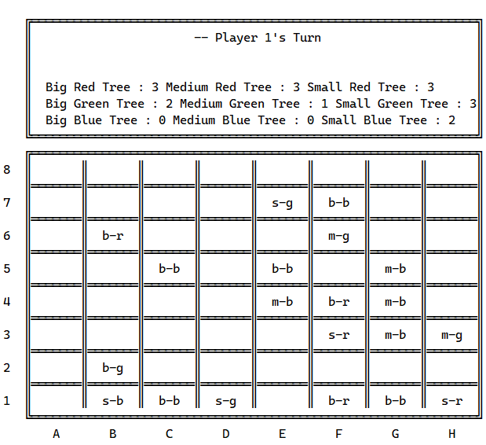
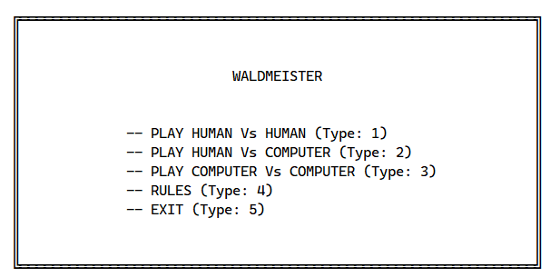
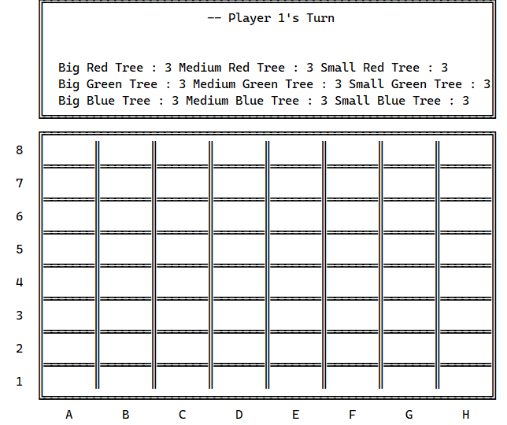

# Wald Meister 
- Group designation : Wald_meister_6
- David José Prata Barbedo Magalhães - up201907075 - 50%
- Miguel Ângelo Aguiar e Nogueira - up202005488 - 50%


## Installation and Execution

- SISCtus prolog 4.8.0
- Cascadia Code Font ([Windows](https://www.cufonfonts.com/font/cascadia-code), [Linux](https://allthings.how/how-to-get-windows-terminal-font-cascadia-code-in-ubuntu-terminal/))


- In SISCtus Prolog, open the `file` menu then click `compile` then search for `wald_meister.pl` in the `src` folder.

## Description of the game

Wald meister is a game between two players. Each player starts the game with 27 pieces, called trees. (3 Big Red Trees,3 Medium Red Trees,3 Small Red Trees,3 Big Blue Trees,3 Medium Blue Trees,3 Small Blue Trees,3 Big Green Trees,3 Medium Green Trees,3 Small Green Trees).

Both players try to form clusters(groups) of trees of the same color or height. In the end only the biggest of each type counts(For example if there is a cluster of 6 red trees and a cluster of 7 red trees only the 7 counts - see end of game section for better explanation). Before the game starts players agree on who will focus on color or height. (For example Player 1 focus on color therefor Player 2 focus on Heights)

In the first move, the first player chooses a random place to put a tree.

After the first move, the player moves one of the trees on the board and then places one of is own trees on the place that he just moved the tree from. Trees can only be moved in straight lines (Horizontally or Vertically) and can't jump over other trees.

The game ends when both players have placed all their trees on the board.

Then we proceed to count the biggest cluster of each type of tree, as in red trees, green trees, blue trees, as well as big trees, medium trees and of small trees.

Then we add: `biggest cluster of red trees + the biggest cluster of green trees + the biggest cluster of blue trees = Total Color` and 
the `biggest cluster of big trees + the biggest cluster of medium trees + the biggest cluster of small trees = Total Height`. The player with the biggest number wins. 

If this is not clear please refer to the `rules.pdf` in the documentation folder.

## Game Logic

### Internal Game Representation

We have updating representations of the current board, the number of trees each player has and the current turn.

- The 8x8 board is represented as lists of lists, each containing a list of 8 elements each. The board size is fixed as stated in the game rules. 

- The numbers of trees is represented with a list. Since each player has different types of trees, we use a list, and each list index holds a number of a different type of tree. For instance the first element of the list is the number of Big Red Trees and the second element is the number of Medium Red Trees and so on.

- The current turn is represented with a '1' if its Player 1's turn or with '2' if its Player 2's.

#### Example of the representation of the board, the turn and the count of player trees:



- Trees are represented by their initials. For example Big Red Tree is represented b-r. Medium Blue would m-b.

### Game State Visualization

- To display the main menu we use the `draw_main_menu/0` predicate in the `output.pl` file.

#### The menu system



- To display the game we use the `display_game/3` predicate in the `output.pl` file.

For interaction with the user we use the `read/1` predicate to read information from the terminal. Input validation is done by comparing the input given by the user with the possible options available. For example: 

#### Example of input validation
```prolog
% validate_first_move_exception_input(+Input) - validates Input
validate_first_move_exception_input(C-R-H-Color) :-  
        atom(C), 
        number(R), 
        atom(H), 
        atom(Color), 
        member(C, ['a','b','c','d','e','f','g','h']), 
        member(R,[1,2,3,4,5,6,7,8]), 
        member(H,['b','m','s']), 
        member(Color, ['r','g','b']), !.
validate_first_move_exception_input(_Input) :- write('Input is not valid!'),nl,fail,!.
```

#### Empty Board


### Move Validation and Execution

- Moves are obtained as exaplained earlier through user input. After the validation, mentioned in a section above, we use a list of all valid moves and check wheter the move given by the player is in that list. We did this so that if the user inputs an invalid input we can repeat the request and try again. Input validation is in the `input.pl` file.

- Moves are executed using the predicate `move(+GameState,+Move,-NewGameState,+Type)` which updates the board. There are two different types of moves, 'moving moves' in which a piece already on the board is moved, and 'placing moves' in which a piece is placed on the board. The predicate works differently for each move types.

- For 'Moving Moves' we use the auxiliar predicate `update_board_move` which firstly deletes the tree from its original position, then calculates its new coordinates and finally places it in its new position.

- For 'Placing Moves' we use the auxiliar predicate `update_board_place` which just places a tree in the specified position.

### List of Valid Moves

To generate a list of valid moves in any phase of the game we use `valid_moving_moves/2` and `valid_placing_moves/3`.

- `valid_placing_moves/2` finds which types of trees the player still has left. The Player starts with 3 trees of each type if it reaches 0 then They can no longer use that type.

- The `valid_moving_moves/3` finds all possible ways a tree can move in a game state. Given trees can only move horizontally and vertically and can't jump over other trees, this predicate analyses the column and row in which the tree is inserted and produces a list of its possibles moves.


### End of Game

To check if the game has ended we use `end_of_game/3`. If it has, then we call the predicate `game_over/3`.

In `game_over/3` we count the biggest clusters of each player, as in red trees, green trees and blue trees, then we sum these numbers and obtain the total for color clusters. Then we repeat the process for the height clusters, the biggest cluster of big trees, then medium trees and cluster of small trees, we add them all up and get the total for the height clusters. If the total color cluster is higher than the total for height, then the player whose objective was 'color' wins. Otherwise the player with 'height' wins.


Note: Our game does not represent colors, they were added in post for better visual representation. Also, there are two boards in the image because some trees are used in both Height and Color clusters so its easier to see using two boards. Both boards in the picture represent exactly the same game.

### Game State Evaluation

We use the predicate `value/2` to check the current evaluation of the position. The predicate works similarly to the game_over predicate, as we count each players biggest clusters and obtain its sums, then subtract height from color (`Color - Height`) and use that as the evaluation of the position. Essentially, if the number is positive(`Color > Height`) then the player doing color clusters has the advantage. If the number is very high then its a big advantage. If the number is negative(`Height > Color`) it means that the player doing height clusters has the advantage. If the number is very negative then its a big advantage. If its zero(`Color = Height`) then the game is currently in a drawn position.


### Computer Plays

- For the level 1 computer we generate a list with all the possible moves and the choose one move at random from the list.

- For the level 2 computer we generate a list with all the possible moves then using the value/2 predicate explained above, we try all the moves and choose the one that leads to the biggest advantage.


## Conclusions

In conclusion, Prolog was difficult at first, but upon creating the first few predicates it became easier to understand. Overall, we felt that we implemented the information we learned in class and had a great time working on this project.

However there are some known flaws that, had we more time, we would address:

- Fixed board size: The size of the board is fixed at 8x8. We did not implement an option for changing the board size because then we would also have to change the amount of trees each player had and It would only work with some specific board sizes. Therefor we chose to stick with the original rules of the game and only use 8x8 board size.

- Slow Computer algorithm: The algorithm to choose the best computer move takes some time to process. In the beginning and middle of the game when there are a lot of possible moves since we have to analyse each move it takes some time for it to run. From the middle to the end it gets significantly faster and by the end is pretty much instant. Apart from this the computer works well as it beats the level 1 computer by a big margin.

- Refactoring: The code could use some refactoring as it can get confusing at times.

## Bibliography

- [Wald Meister](https://boardgamegeek.com/boardgame/371135/waldmeister)
- [Swi Prolog](https://www.swi-prolog.org/pldoc/doc_for?object=section(%27packages/pldoc.html%27))
- Moodle Slides
